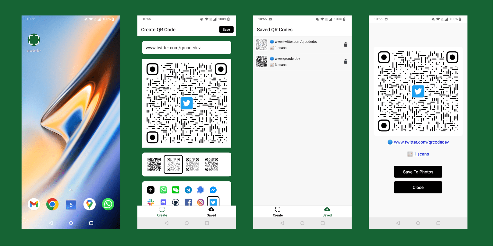

In today's interconnected world, QR codes bridge the gap between the digital and physical. For Android enthusiasts 🤖 keen on crafting and analyzing QR codes, here's a precise roadmap:

1. **[Download the qrcode.dev app from the Google Play Store.](https://play.google.com/store/apps/details?id=com.danny021.qrcodedev)**
2. **Design and Personalize:** Launch the app and create your first QR Code. Play with diverse design options 🎨, and for that extra touch of identity, infuse your brand or logo 🖼️.
3. **Analytics at Your Fingertips:** The beauty of qrcode.dev lies in its analytics capability. Save the QR code to your device and watch as scan metrics roll in, providing invaluable insights into its usage.
4. **Sharing Made Easy:** Save to your photo gallery by tapping "Save to Photos" for hassle-free sharing.

In mere moments, you have at your disposal a QR code not only personalized to your taste but also equipped with tracking prowess. Tech-savvy users might be intrigued by [qrcode.dev's API](https://www.qrcode.dev/api) facilitating QR code creation automation.
