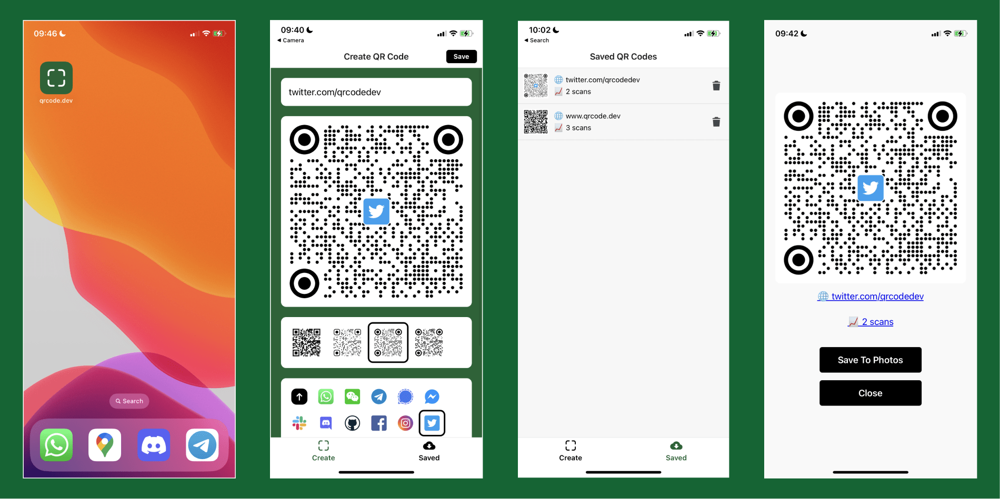

In the digital era, QR codes are indispensable. For iPhone aficionados 🍏 looking to both generate and track QR code scans, here's your step-by-step guide:

1. **[Download the qrcode.dev app from the App store.](https://apps.apple.com/app/create-qr-codes-qrcode-dev/id6466261269?platform=iphone)** This trusted application is perfect for both beginners and seasoned iPhone users.
2. **Design and Brand:** After launching the app, dive into crafting your unique QR code. Experiment with diverse designs 🎨 and incorporate a distinct logo or brand 🖼️ to make your code stand out.
3. **Track Scan Metrics:** A standout feature of qrcode.dev is its ability to track scans. By saving the QR code to your device, you can gain insights into its performance and reach.
4. **Seamless Sharing:** Once satisfied, easily share your QR code. Simply view the created code and tap "Save to Photos".

In just a few steps, you have a QR code tailored to your needs, equipped with tracking capabilities. For those with a technical inclination 🤖, [qrcode.dev's API](https://www.qrcode.dev/api) offers a route to automate the QR code creation process.
