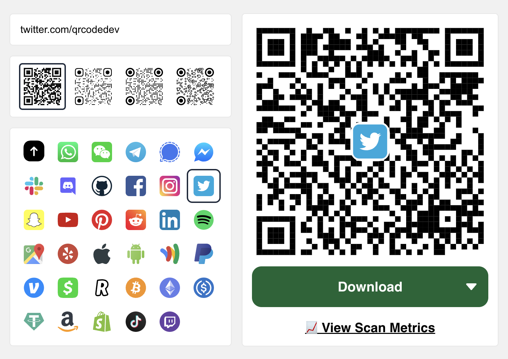

As the digital landscape evolves, QR codes remain a vital bridge between the virtual and tangible realms. For users who value the convenience of Google Chrome 🌐, creating and monitoring QR codes is now more accessible than ever. Dive into this easy-to-follow tutorial:

1. **[Install the qrcode.dev extension on Chrome.](https://chrome.google.com/webstore/detail/create-qr-codes-qrcodedev/eijaaabkjcalefnjamhlajpjpibobodn)**.
2. **Craft with Precision:** Input your QR Code link and personalize with the style options available.
3. **Track Scan Metrics:** No more guesswork! Tap on the '📈 View Scan Metrics' link to witness real-time analytics, revealing the reach and resonance of your QR masterpiece.
4. **Share:** Download your QR creation as a PNG, JPG, or SVG, ready for the world to scan and explore.

Within a few clicks, your Chrome browser becomes a powerful QR code arsenal, merging intuitive design with comprehensive scan analytics. For those eyeing even more customization and automation, be sure to explore the potential of [qrcode.dev's API](https://www.qrcode.dev/api).
