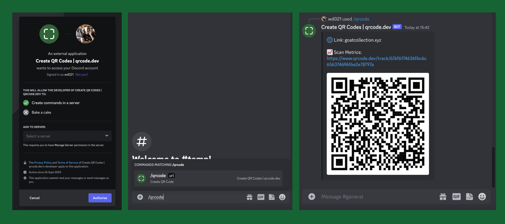

Here's how you can create QR codes in Discord:

1. **[Add the qrcode.dev bot to your Discord.](https://discord.com/api/oauth2/authorize?client_id=1156361106894368809&scope=applications.commands)**
2. **Command the bot:** Type `/qrcode` followed by [your url]. Example: /qrcode example.com.
3. **Retrieve Your QR Code:** The bot promptly replies with a QR Code and a stats link to track scans.

And you're done!

For advanced customizations and integrations, consider the [qrcode.dev's API](https://www.qrcode.dev/api).
