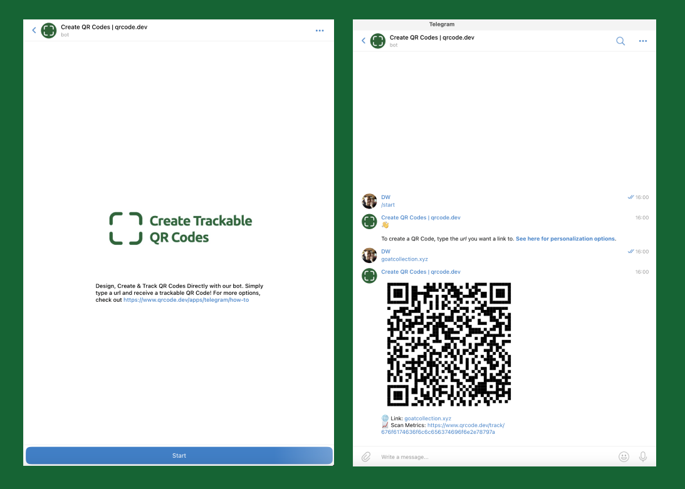

Here's how you can create QR codes in Telegram:

1. **[Start a chat with @theqrcodebot on Telegram.](https://t.me/theqrcodebot)**
2. **Generate a QR Code:** Simply send a URL to the bot, and in return, you'll get a QR Code along with a tracking link.

And you're done!

For advanced customizations and integrations, consider the [qrcode.dev's API](https://www.qrcode.dev/api).
