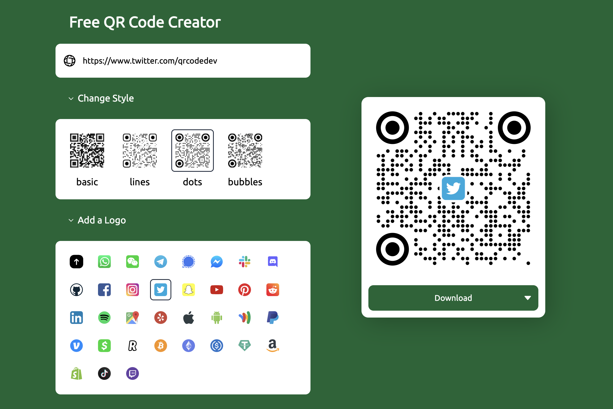

The world today thrives on quick digital access, and QR codes 📱 play a pivotal role in ensuring that. Want to create your own QR code? Here's a concise guide to making a visually appealing QR code in no time!

1. Visit **[qrcode.dev](https://www.qrcode.dev)** and enter the desired URL 🌐 into the input box.
2. Expand the **Change Style** section to pick a different design 🎨.
3. Expand the **Add a Logo** section to add a logo 🖼️ . You can upload an image or pick an icon.

4. Click **Download** 💾. You can choose to download as a PNG, JPG, or SVG.

There you have it—your tailored QR code, ready to be scanned! For those inclined towards automation 🤖, check out [our API](https://www.qrcode.dev/api) for programmatic QR code generation.
